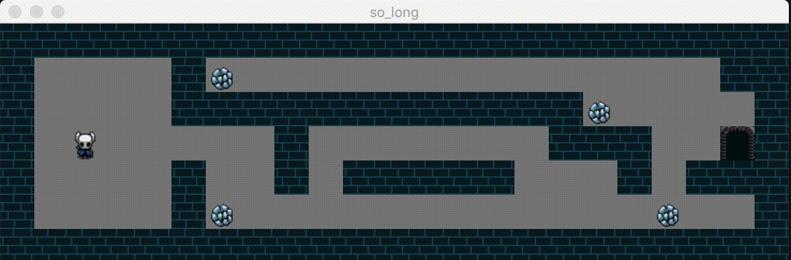

# so_long

<pre>
.
|
├─ MLX/
├─ include/
|  └─ so_long.h
├─ libft/
|  └─ get_next_line/
|  └─ printf/
|  └─ ...
├─ maps/
|
├─ Makefile
├─ animation.c
├─ draw.c
├─ exit_game.c
├─ game.c
├─ init.c
├─ map_validate.c
├─ player_update.c
├─ read_map.c
├─ so_long.c
└─ wall_texture.c
</pre>

## Introduction
In this project, we'll code a simple 2D game to get familiar rwith mlx library and UI in general.

## Controls
Arrow keys or:
* w - up
* s - down
* a - left
* d - right
  
