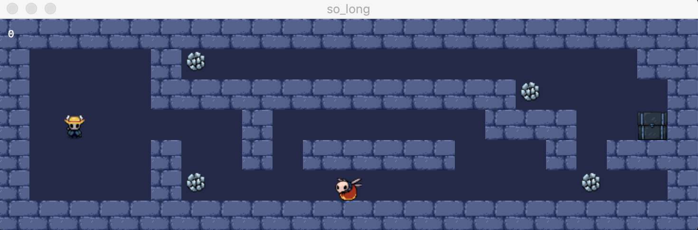

#  So_long 
<pre>
.
|
├─ MLX/
├─ include/
|  └─ so_long.h
|  └─ so_long_bonus.h
├─ libft/
|  └─ get_next_line/
|  └─ printf/
|  └─ ...
├─ maps/
├─ sources/
|  └─ draw.c
|  └─ exit_game.c
|  └─ game.c
|  └─ init.c
|  └─ map_validate.c
|  └─ player_update.c
|  └─ read_map.c
|  └─ so_long.c
├─ sources_bonus/
|  └─ animation_bonus.c
|  └─ draw_bonus.c
|  └─ exit_game_bonus.c
|  └─ game_bonus.c
|  └─ init_bonus.c
|  └─ map_validate_bonus.c
|  └─ moves_bonus.c
|  └─ player_update_bonus.c
|  └─ read_map_bonus.c
|  └─ so_long_bonus.c
└─ sprites/
</pre>

# Proyect Structure

The first thing we will need to understand is how the functions of miniLibX, the library for programming simple graphical applications that we are allowed to use in this project, work.

Once we know this, depending on the requirements specified in the subject, the project will require:
  
### Game info

A structure in which we store all the relevant information for the correct operation of the program, for example:
* The pointers to the window and to each image that we want to load in the video game
* The map
* The coordinates with the player's position
* The count of moves and coins

### Map handing
Map handling
* Create several maps, which will be two-dimensional arrays of characters in .ber format
* Check that the map shape is correct: rectangular and surrounded by walls
* Check the content: a starting position, an exit and at least one collectible object
* Check that there is at least one valid path
* Read the map and load it into memory

### Window management
* Manage the creation of the window
* Manage the hooks so that ESC, Q and the red cross of the window close it
* Manage that closing the window stops the program cleanly

### Image management
* Choose the theme and sprites to use
* Transfer the images to .xpm
* Load the images in memory
* Load the images in the window

### In-game events
* A loop-handler that opens and manages the loop in which the game takes place
* Manage the hooks so that the character can move with the W, A, S, D and ←, ↑, →, ↓ keys
* Redo the map with each movement of the player, updating the player's position, and making the collectibles disappear if he retakes them
* Manage the movement count (which should be displayed on the screen) and the count of collected collectibles

<pre align="center">
111111111	┌────┬───────┐
1P0100C01	│☺   │    ❀  │
100000001	│            │
10C000E01	│   ❀     █  │
100010001	│       │    │
111111111	└───────┴────┘
</pre>
